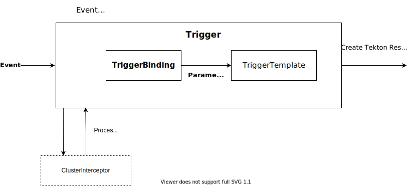

<!-- prettier-ignore start -->
<!--
---
title: "Triggers and EventListeners"
linkTitle: "Triggers and EventListeners"
weight: 3
description: >
  Event Based Triggers for Tekton Pipelines
cascade:
  github_project_repo: https://github.com/tektoncd/triggers
---
-->

<!-- prettier-ignore end -->

# Tekton Triggers

Tekton Triggers is a Tekton component that allows you to detect and extract information from events from a variety of sources and deterministically instantiate
and execute [`TaskRuns`](https://github.com/tektoncd/pipeline/blob/master/docs/taskruns.md) and [`PipelineRuns`](https://github.com/tektoncd/pipeline/blob/master/docs/pipelineruns.md)
based on that information. Tekton Triggers can also pass information extracted from events directly to `TaskRuns` and `PipelineRuns`. You install Tekton Triggers on your Kubernetes
cluster as an extension to Tekton Pipelines.

## How does Triggers work?

Tekton Triggers consists of a controller service that runs on your Kubernetes cluster as well as the following Kubernetes Custom Resource Definitions (CRDs) that extend
the functionality of Tekton Pipelines to support events:

*  [`EventListener`](eventlisteners.md) - listens for events at a specified port on your Kubernetes cluster.
   Specifies one or more `Triggers`.

*  [`Trigger`](triggers.md) - specifies what happens when the `EventListener` detects an event. A `Trigger` specifies
   a `TriggerTemplate`, a `TriggerBinding`, and optionally, an `Interceptor`.

*  [`TriggerTemplate`](triggertemplates.md) - specifies a blueprint for the resource, such as a `TaskRun` or `PipelineRun`,
   that you want to instantiate and/or execute when your `EventListener` detects an event. It exposes parameters that you can use anywhere within your resource's template.

*  [`TriggerBinding`](triggerbindings.md) - specifies the fields in the event payload from which you want to extract
   data and the fields in your corresponding `TriggerTemplate` to populate with the extracted values. You can then use the populated fields in the `TriggerTemplate` to
   populate fields in the associated `TaskRun` or `PipelineRun`.

*  [`ClusterTriggerBinding`](triggerbindings.md) - a cluster-scoped version of the `TriggerBinding`,
   especially useful for reuse within your cluster.

*  [`Interceptor`](interceptors.md) - a "catch-all" event processor for a specific platform that
   runs before the `TriggerBinding` enabling you to perform payload filtering, verification (using a secret), transformation, define and test trigger conditions, and other
   useful processing. Once the event data passes through an interceptor, it then goes to the `Trigger` before you pass the payload data to the `TriggerBinding`.

## What can I do with Triggers?

As an example, you can implement the following CI/CD workflow with Triggers:

1. Triggers listens for a git commit or a git pull request event. When it detects one, it executes a unit test [`Pipeline`](https://github.com/tektoncd/pipeline/blob/master/docs/pipelines.md) on the committed code.

2. Triggers listens for a git push event indicating the test finished successfully. When it detects one, it validates the test's outcome and executes a `Pipeline` that builds the tested code.

3. When the associated `PipelineRun` completes execution, Triggers checks the outcome of the build, and if it's successful, executes a [`Task`](https://github.com/tektoncd/pipeline/blob/master/docs/tasks.md)
   that uploads the build artifacts to the Docker registry of your choice.

4. Finally, the Docker registry sends an event to [Pub/Sub](https://cloud.google.com/pubsub/docs/overview), which triggers a `Pipeline` that pushes the build artifacts to a staging environment.

## Further Reading

To get started with Tekton Triggers, see the following:

*   [Setting Up Tekton Triggers](install.md)
*   [Getting Started with Tekton Triggers](https://github.com/tektoncd/triggers/blob/main/docs/getting-started/README.md)
*   [Tekton Triggers code examples](https://github.com/tektoncd/triggers/tree/main/examples)
*   [Troubleshooting Tekton Triggers](troubleshooting.md)
