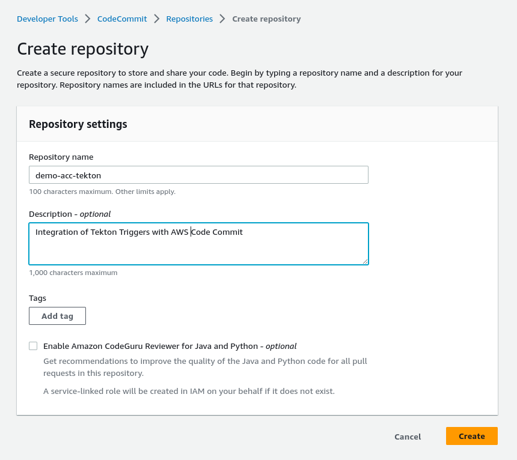
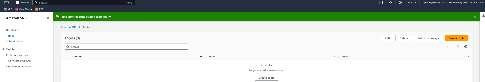
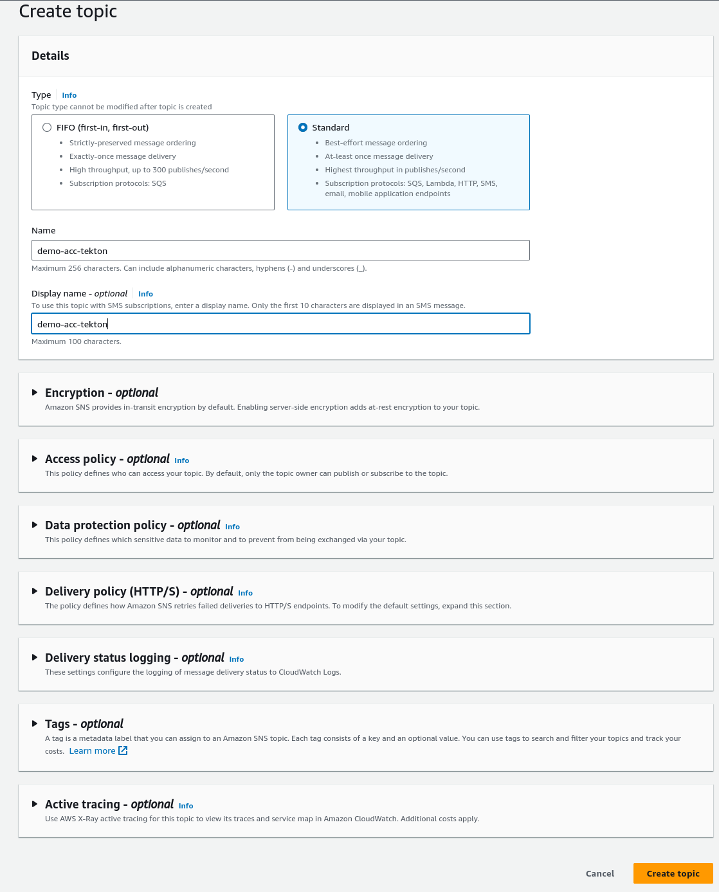
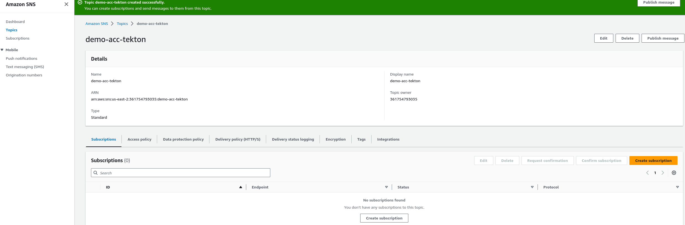
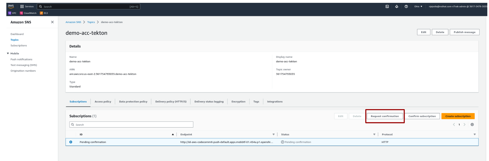
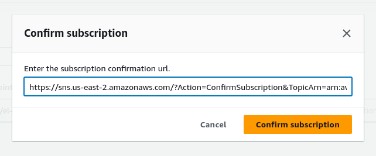
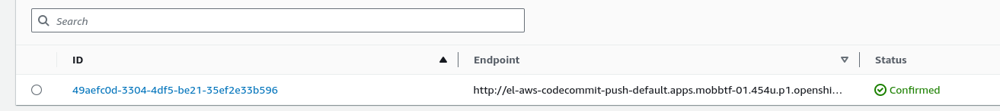
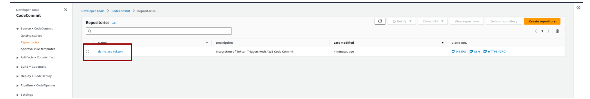
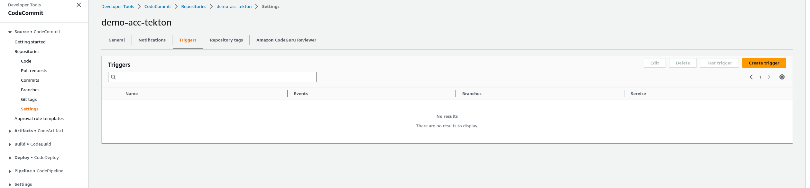
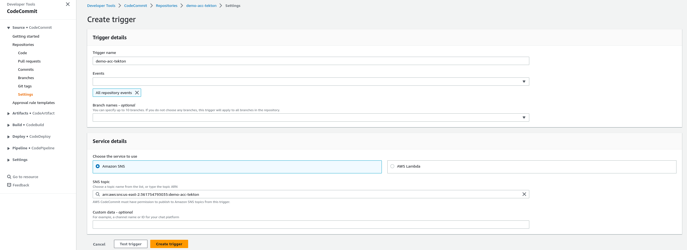

## AWS CodeCommit push EventListener

Creates an EventListener that listens for AWS CodeCommit push request.

### Pre-requisites

1. Enable [debug logs for Triggers eventlistener](https://github.com/tektoncd/triggers/blob/main/docs/troubleshooting.md#configuring-debug-logging-for-eventlisteners)  (This will be helpful for getting subscription URL which you do in later section)
2. Should have access to AWS
1. Should have URL accessible publicly to configure in webhook

### Steps to try:

1. To create the AWS CodeCommit push eventlistener and all related resources, run:

   ```bash
   kubectl apply -f .
   ```

1. To get the eventlistener URL, run:

   ```bash
   kubectl get el
   ```

### Steps for AWS CodeCommit configuration

1. Login to aws console
2. Search for CodeCommit aws service
3. On left side of the panel select **Source** -> **Repositories** -> **Create repository**
 
4. Once after successful creation of repository follow below steps to add Triggers
5. a) Create SNS (Simple Notification Service)

   ai) Search for sns service
   

   aii) Click on Create topic

   

   aiii) Click on **Create subscription**

   1. 
   
   2. 
   
   3. Once **Create subscription** is success click on **Request confirmation**
   
      a. Then go to eventlistener pod

      i. oc logs -f <pod-name>

      ii. Search for SubscribeURL and copy value

            "SubscribeURL\" : \"https://sns.us-east-2.amazonaws.com/?Action=ConfirmSubscription&TopicArn=arn:aws:sns:us-east-2:361754793035:demo-acc-tekton&Token=2336412f37fb687f5d51e6e2425c464de257e9a5924e2fd4cf343ac0f1dcdb40cc7dad021f86dcf2af98fbabf59b6314b975e5d5bfc673924522ab99cb9b45b824a2795d81328e045db0148571c0ba451648f60157690c2c377eb41f58a7d663c15a36654beda27c295f9f90cc8a0f46096aea96a40f9c4ca0b1ec1092e32116\"

   4. Click on **Confirm subscription**
   
         
   5. Make sure Status as **Confirmed**

      

   aiv) Now go back to CodeCommit page

**!!!!!Done with SNS configuration go back to codecommit flow!!!!!**

   b) **Source** -> **Repositories** and select demo-acc-tekton
      

   c) Go to **Settings -> Triggers** then click on **Create trigger**
      
   
   d) While creating trigger give trigger name, set the events to All repository events, Service to use AWS SNS, and finally, choose the previously configured SNS topic
      
   e) Once the **Create trigger** is successful go back to Repository and send Push Request.

**!!!!!Done with CodeCommit configuration!!!!!**

   f) You should see a new TaskRun that got created:

   ```bash
   kubectl get taskruns | grep aws-codecommit-push-listener-run-
   ```
